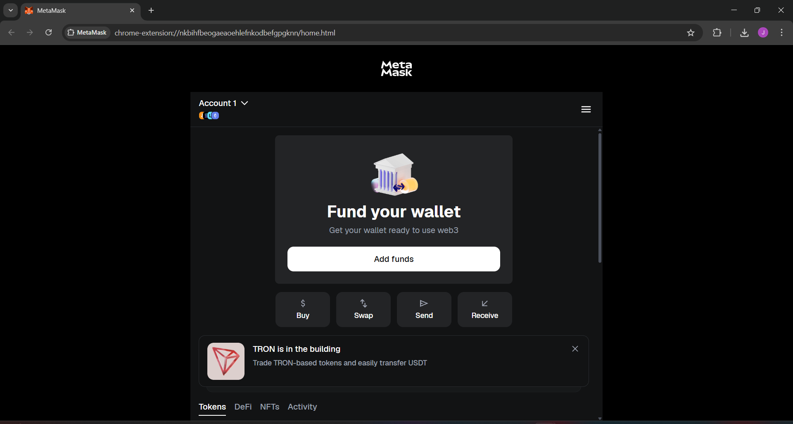
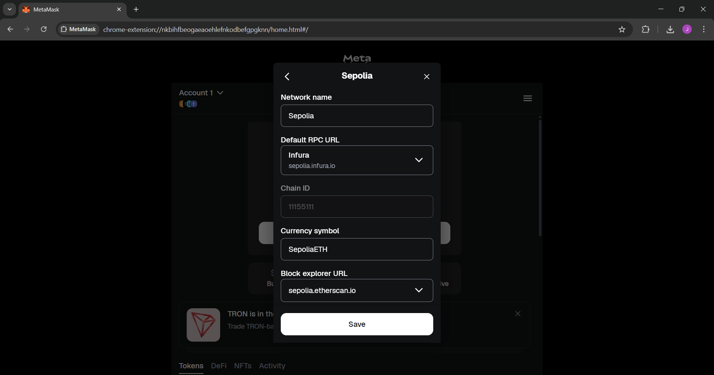
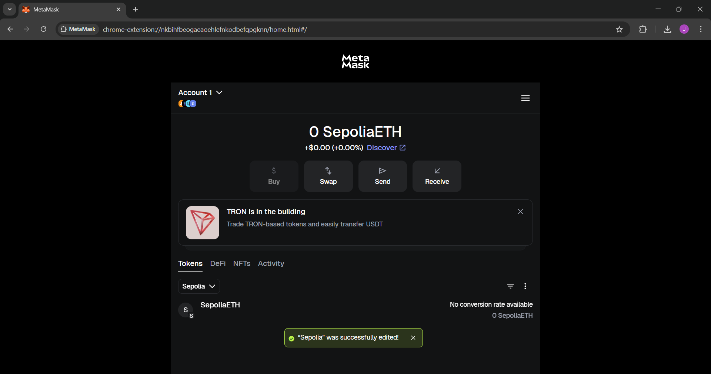
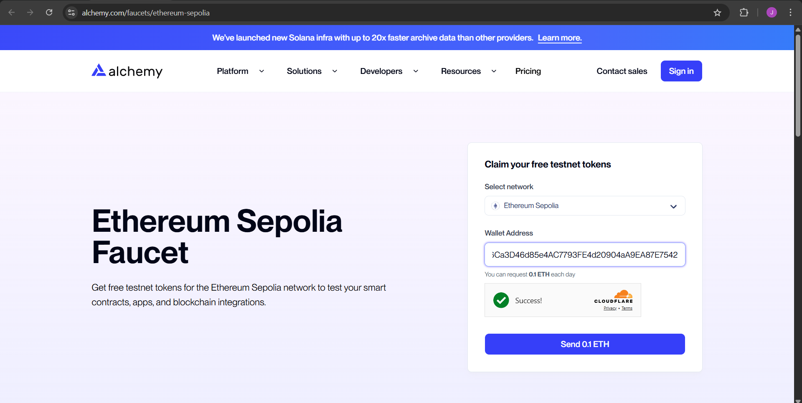
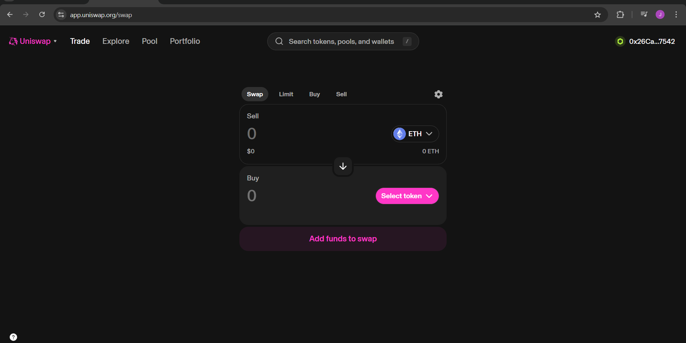
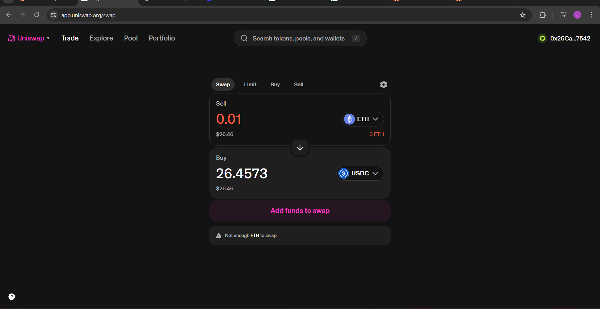

# Blockchain Web3 Foundations Project


> A reproducible project demonstrating wallet setup, funding, verification, and decentralized application interaction on the Ethereum Sepolia testnet.

---

## 📖 Overview
This repository documents the workflow for interacting with the Ethereum Sepolia testnet:
- Wallet creation and configuration  
- Funding via faucet and verification on Etherscan  
- Interaction with a decentralized application (Uniswap)  
- Repository polish for evaluator review  

---

## 🛠 Prerequisites
- MetaMask installed and configured  
- Sepolia testnet added to MetaMask  
- GitHub repository for documentation and screenshots  

---

## ✅ Proof of Work

  
  
  
    
  
  

---

## 📂 Repository Structure
```
blockchain-web3-foundations/
│
├── screenshots/        # Proof of work images
│   ├── wallet_setup.png
│   ├── network_config.png
│   ├── wallet_balance.png
│   ├── faucet_request.png
│   ├── faucet_tx.png
│   ├── etherscan_tx.png
│   ├── dapp_connect.png
│   └── dapp_action.png
│
├── README.md           # Documentation
├── LICENSE             # MIT License
└── .gitignore          # Ignore unnecessary files
```

---

## 📜 License
This project is licensed under the MIT License. See the [LICENSE](LICENSE) file for details.

---

## 🏆 Notes
- Screenshots provide visual proof of each stage.  
- Repository is reproducible and polished with badges, LICENSE, and clear structure.  
- Conventional commit messages used for clarity.  
```

